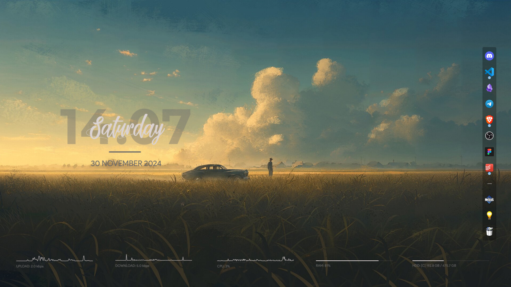

# Pretty Windows 

This repo contains the tools and software I used to customize the look of my Windows.

## Softwares I used:
### [NeXuS](https://www.winstep.net/nexus.asp)
I used NeXus add a dock almost similar to Mac but I positioned it into the right side of the screen. NeXus is highly customizable, you can customize it based on your preference.

### [Rainmeter](https://www.rainmeter.net/)
I used Rainmeter to add additional systems information like the _CPU_, _RAM_, and _SSD_. I also added _Uplaad speed_ and _Download speed_ information, but this is highly customizable, you can add any skin that you'd like. To discover skins that you can use, you can visit this [link](https://www.rainmeter.net/discover/).

For the skin I used, you can visit this [link](https://www.deviantart.com/apexxx-sensei/art/Robik-771914763). 

### TranslucentTB
I've set my taskbar to "Automatically hide the taskbar", so you couldn't see the effect from the screeshot above. But what TranslucentTB basically doing here is just making the Windows taskbar transparent. You can install it from Microsoft Store 

### Wallpaper 
You can find the wallpaper I used here: [wallpaper](https://ph.pinterest.com/pin/584975439131176050/) 

### Why?
tired of the default look of Windows, so I decided to customize it to make it look better. However, it’s still nowhere near the level of customization that others achieve using Linux.

## Connect with me!
- [X/Twitter](https://twitter.com/jfmartinz)
- [LinkedIn](https://www.linkedin.com/in/jfmartinz/)
